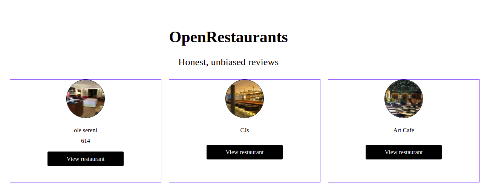

# Restaurant Review App
####  The Restaurant Review App is a powerful marketing stratgy tool that enables people to know about the services of various restaurants in their country. The application enables users to view their favourite restaurants, check the restaurants ratings and more importantly add their own reviews. 

#### By **Gitau Elvis Munene**
## Description
With this app, customers are able to select restaurants with more informed decisions. Besides, they are able to give their honest reviews after visting the restaurant. Overall, the application ensures that restaurants give quality services to customers and in the end the restaurant is marketed on social media following positive reviews from customers.

# Public API links
https://restaurantreviewdatabase.herokuapp.com/restaurants
https://restaurantreviewdatabase.herokuapp.com/reviews
## Setup/Installation Requirements
* Visual Studio
* Installation of dependancies.
* Server.
## Known Bugs
The user interface needs more styling
## Technologies Used
*HTML
*CSS
*React.
*Ruby
## Support and contact details
Email: elvisgitau10@gmail.com
slack: Gitau Elvis

### License
 **MIT License Copyright (c) 2022 Elvis Munene*

